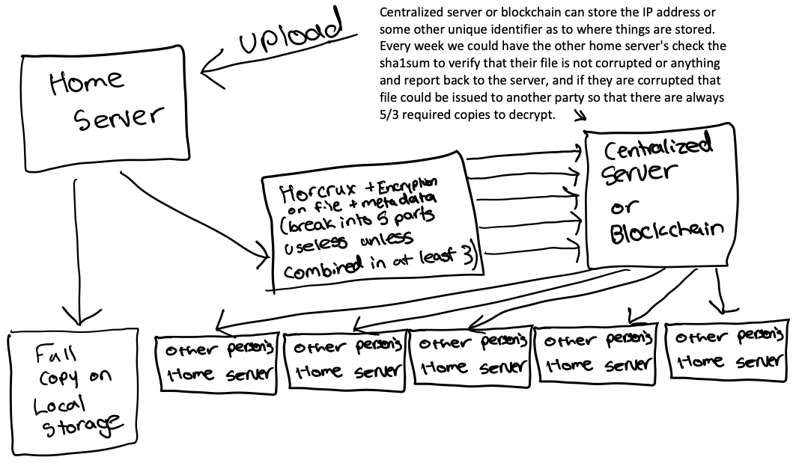

# OpenOffsite

## An open-source service designed to simplify decentralized offsite data backups among the community.

### How it works

OpenOffsite acts as the gateway to an offsite raid system, where your data is split up into 5 (this is an arbitrary number, need to research what is optimal) parts and then shared across our network of users onto different servers across the globe. Your local copy of your data is used by you, and in the event that your hard drive fails or is damaged, you can recover your data from the network of servers.

This file split-up and encryption utilizes an open-source project called [horcrux](https://github.com/jesseduffield/horcrux). In our service, we split your file into 5 parts in such a manner that only 3 are required to piece all of your data back together. This means that even if 2 of your 5 backups go offline or are corrupted, you can still piece together your data.

As you send off a file to be saved offsite, all five horcrux files are made ready to be streamed via [croc](https://github.com/schollz/croc). Each unique croc code gets added to the queue section of our database along with its file size. Servers that are online and are able to receive that data then respond to the database to inform it that their API key would like access to the croc code.

The database verifies their API key and that they have enough free storage and replies with the croc code from the database to download the horcrux file. This offsite server belonging to someone else that has just downloaded the horcrux file now confirms that no data was corrupted in transfer using a checksum stored on the database.

Assuming all transfers went successfully, the database now stores which API key has downloaded which horcrux. This means that in the event that the original file owner has a drive fail, they are able to request their horcruxes be sent back to be rebuilt into the original file. The database can identify which server's are storing their files, and can even automatically email server owners with offline servers to bring their server online if they are storing a horcrux someone needs.

In addition to these multiple layers of redundancy, if even one server storing one of your horcrux files drops below an 85% uptime or fails a checksum on a horcrux, your server will be notified and will automatically redistribute a new set of horcurxes to more servers with healthy drives.

### Usage

In order to use OpenOffsite as part of our decentralized network of users, you must be willing to offer 5 times the amount of data you want backed up offsite as your own backup server for other people. This means if you want to backup 250GB offsite, you will need an additional 1TB to backup other user's data. This excess of storage ensures there is always space to backup your data offsite on command, and that there are duplicates and redundancies in place so that you need not worry about the safety of your offsite data.

Furthermore, by utilizing another open-source tool called [croc](https://github.com/schollz/croc), you do not even require opening up your server to the public internet or sharing your IP address with anyone else. The entire data transfer is routed through croc's proxy service and is more often than not capped by your internet's upload speed than anything else.

### Hardware Requirements

-   At least 5x the storage size you want to backup made available for others to use
-   A stable connection to the internet with a minimum of an 85% uptime as measured by our servers
-   An email address that our service can automatically reach you at if you hold a copy of a horcrux someone needs urgently and your server is offline
-   Other requirements to be tested...

### Installation

-   Installation steps to be compiled...

### FAQs

#### Q: How is this different from other options, such as [FileCoin](https://filecoin.io/)?

A: FileCoin caters primarily to the public dataset market. While possible to store private data, it is most efficient in terms of public data storage and quite frankly solves a different use case in that regard. Where FileCoin provides fast and cheap file access to areas further from data centers and helps break the market free of monopoly pricing, OpenOffsite aims to provide the self-hosting crowd with a free option (at the expense of storage) to easily store data as purely a backup, and not a main content delivery network for said data.

#### Q: Should I be worried about the privacy of my data and server?

A: No! By using [horcrux](https://github.com/jesseduffield/horcrux), a malicious actor would need to gain access to at least three of your different backups. Locating these backups would require breaching our server's AND your server for your API key. In the event that this level of security is not enough for you, in OpenOffsite's configuration you are able to select an encryption algorithm and key to use so that your data is encrypted before being horcruxed. In addition to data security, your server does not need to be made public on the internet in any regard. All your server needs to do is remain online with a stable internet connection so that it can monitor our server's and watch for any data requests. All data transfers are made in a peer-to-peer manner in order to optimize speed and decrease database hosting costs. These transfers are routed through a proxy, however, so your IP is never made known to anyone else.

#### Q: What kind of data is stored on your server's and why is it not on Blockchain?

A: First off, we elected not to use blockchain in order to speed up our service, improve security, and prevent anyone from needing to store even more data to keep the blockchain up to date. When you download our code and sign up to use our network, you are given an API key. In our database, we then record how much data you are able and willing to store and how much you have stored. We also keep track of what servers are storing your horcruxes and what servers you are storing horcruxes for. In addition, we periodically ping your server to check its uptime and keep track of the running uptime percentage. In order to speed up our data transfer process, we also log your average internet speeds (both upload and download) so that we can try and match you with others that have similar speeds, this way, neither server has to wait exceptionally long for the other. Lastly, we keep the checksums of all your horcruxes in order to run periodic authenticity checks.
